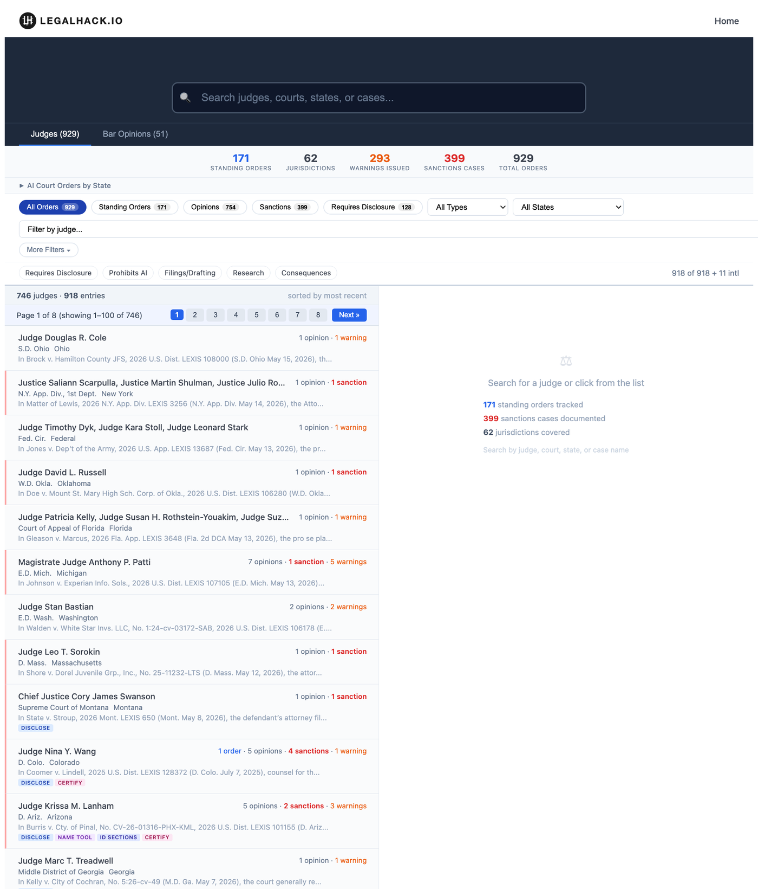
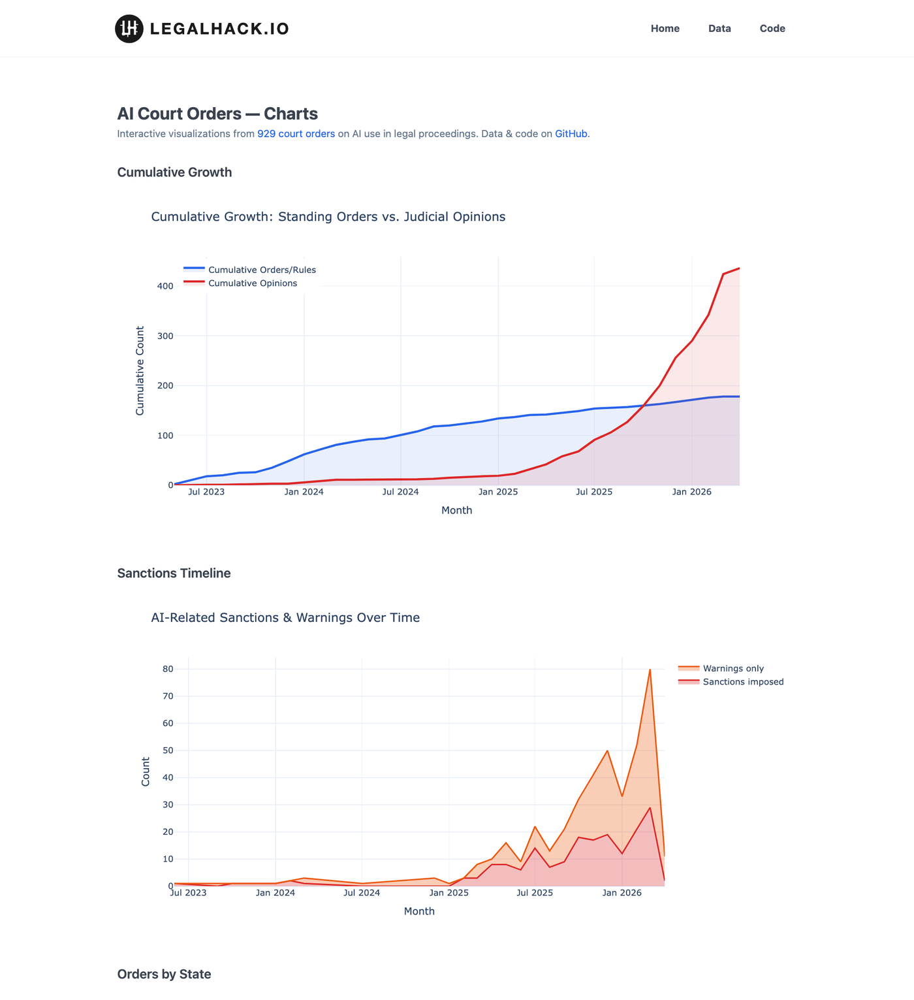

# AI Court Orders Explorer

Has your judge issued an AI standing order? What happens when attorneys use ChatGPT to draft filings?

This is a searchable database of **900+ court orders and opinions on AI use in legal proceedings**, from May 2023 to present. Search by judge, state, court, order type, or outcome — with free links to original sources on CourtListener, and self-hosted PDFs of the primary documents where archived. No Westlaw or Lexis required.

**[Search the database →](https://legalhack.io/explorer)** | **[Charts & trends →](https://legalhack.io/data/charts)** | Companion to the [LegalRealist AI Landscape](https://legalrealist.ai) series ([analysis post](https://legalrealist.ai/posts/31-ai-court-orders-explorer/))



## What's in the data

**929 entries** across **62 jurisdictions** (May 2023 – May 2026):

| Type | Count |
|------|-------|
| Judicial Opinions | 754 |
| Standing Orders | 108 |
| Administrative Orders | 35 |
| Local Rules | 28 |
| Practice Directions | 4 |

**Outcomes tracked:**

| Consequence | Count |
|-------------|-------|
| Sanctions on attorney | 297 |
| Warning issued | 293 |
| Sanctions on party | 102 |

Each entry includes judge name, court, state, date, order type, AI type (generative AI vs other), who it applies to, a plain-English summary, disclosure/verification requirements, consequence, a source link, and — for 517 entries — a self-hosted PDF of the primary document.

[**Charts & trends**](https://legalhack.io/data/charts) plots the dataset over time — cumulative standing orders vs. judicial opinions, and the sharp recent rise in AI-related sanctions and warnings:



## Querying from the command line

`scripts/orders_cli.py` is a zero-dependency CLI over the same dataset. JSON output by default (pipe it anywhere); add `--format table` for human reading. It fetches from legalhack.io and falls back to the local copy when offline.

```bash
# Full-text search, narrowed by filters
python3 scripts/orders_cli.py search "hallucinated citations" --consequence sanctions_attorney

# Which courts require AI disclosure (or a certification)?
python3 scripts/orders_cli.py list --requires disclose --format table
python3 scripts/orders_cli.py facets court --requires disclose

# Which courts sanction attorneys most for AI misuse?
python3 scripts/orders_cli.py facets court --consequence sanctions_attorney

# One record, its self-hosted PDF, and a state bar's AI opinion
python3 scripts/orders_cli.py get 42
python3 scripts/orders_cli.py pdf 42
python3 scripts/orders_cli.py bar California
```

Commands: `search`, `list`, `get`, `facets` (distinct values + counts), `stats`, `pdf`, `bar`. Filters (`--judge`, `--court`, `--state`, `--type`, `--consequence`, `--requires`, date range, `--has-pdf`, `--pending`/`--final`, `--ai-tool`, …) apply to `search`, `list`, and `facets` — so `facets` produces filtered cross-tabs like sanctions-by-court. `--requires <key>` queries the per-record requirements (`disclose`, `certify_if_ai`, `verify`, `prohibited`, …). `--pending`/`--final` separate proposed sanctions (show-cause orders, R&Rs, deferred rulings) from imposed ones. `--ai-tool` filters by the specific AI product named in the order (ChatGPT, Claude, Gemini, Copilot, …). Litigation records carry a stable `slug` — `get <slug>` resolves it.

## Claude skill

[`ai-court-orders`](skills/ai-court-orders/SKILL.md) is a [Claude Code](https://claude.com/claude-code) skill that wraps the CLI above, so you can ask questions in plain English instead of remembering flags — *"what AI rules does the D.D.C. have?"*, *"which courts sanction attorneys most for AI misuse?"*, *"does Judge Wang have an AI standing order?"*. Claude translates the request into the right query, parses the JSON, and answers with source links and PDFs.

**Install (one line):**

```bash
curl -fsSL https://raw.githubusercontent.com/legalrealist/AI-orders-explorer/main/skills/ai-court-orders/install.sh | bash
```

This drops the skill and its bundled CLI into `~/.claude/skills/ai-court-orders/` (override with `CLAUDE_SKILLS_DIR`). The CLI pulls live data from legalhack.io, so nothing else to clone — only `python3` is required.

**Use it.** Restart Claude Code (or reload skills) so the new skill is picked up. Then just ask in plain English — the skill auto-triggers on AI-court-order questions, no slash command needed:

```
which courts sanction attorneys most for AI misuse?
does Judge Nina Wang have an AI standing order?
what AI disclosure rules does the Northern District of Texas have?
show me the sanctions cases over hallucinated citations in 2025
what's California's state bar opinion on AI?
pull the PDF for the Mata v. Avianca order
```

Claude picks the right query, parses the JSON, and answers with judge, court, outcome, source links, and a self-hosted PDF where one exists. You can also invoke it explicitly with `/ai-court-orders <question>` to force it.

**Update or remove it.** Re-run the install one-liner to pull the latest skill + CLI. To uninstall, `rm -rf ~/.claude/skills/ai-court-orders`.

**Manual install (no `curl | bash`):** copy `skills/ai-court-orders/SKILL.md` and `scripts/orders_cli.py` into a single directory at `~/.claude/skills/ai-court-orders/`, then reload Claude Code. (The CLI must sit next to `SKILL.md` — the skill calls it by that path.)

Behind the scenes the skill is a thin wrapper over the [CLI above](#querying-from-the-command-line): every plain-English question maps to a `search` / `list` / `facets` / `get` / `pdf` / `bar` call, so anything the skill can answer, you can also run yourself from the shell.

## Data sources

| Source | What it provides |
|--------|-----------------|
| [Ropes & Gray AI Court Order Tracker](https://www.ropesgray.com/en/sites/artificial-intelligence-court-order-tracker) | Primary source — court orders & opinions via Sitecore API |
| [LegalAIGovernance](https://legalaigovernance.com/) | Bar opinions (`bar_opinions.json`) |
| [CourtListener](https://www.courtlistener.com/) | Free-link replacement for paywalled Lexis citations |

All data sourced from public court records. The pipeline deduplicates on date + state + judge, converts entries via AI with regex fallback, and replaces paywalled links with free alternatives where available.

## Why this exists

Courts are issuing AI orders at an accelerating pace — standing orders requiring disclosure, opinions sanctioning attorneys for AI-generated hallucinated citations, local rules mandating verification. But there's no single place to search them by judge, jurisdiction, or outcome.

This project fills that gap: a free, searchable, regularly updated database with direct links to source documents. If you're advising a client on AI disclosure obligations, preparing for a hearing before a specific judge, or researching the sanctions landscape, this is the starting point.

## Updating the data

```bash
export OPENROUTER_API_KEY="…"   # required: AI conversion of new entries
export CL_API_KEY="…"           # optional: CourtListener link replacement

python3 scripts/update.py             # incremental: fetch new entries, swap Lexis→CL links
python3 scripts/update.py --backfill  # one-time: replace Lexis links across all existing entries
```

The pipeline is incremental — it appends new entries without regenerating existing records. New entries are fetched from the R&G Sitecore API, deduplicated, converted to the explorer schema via OpenRouter AI (with regex fallback), and written to `data/processed/explorer_data.json`.

## Output files

- **`data/processed/explorer_data.json`** — the full dataset (also mirrored to `charts/data/`)
- **`data/processed/bar_opinions.json`** — state bar AI guidance
- **`charts/explorer.html`** — the explorer web app
- **`charts/*.html`** — standalone Plotly trend charts

## For developers

The explorer is a single-page HTML app (`charts/explorer.html`) with no build step — just HTML + vanilla JS + Plotly. The data pipeline is Python.

When hosted on legalhack.io, the explorer includes a brand header (marked by HTML comments). To run standalone elsewhere, delete that block.

## License

Data sourced from public court records via [Ropes & Gray](https://www.ropesgray.com/en/sites/artificial-intelligence-court-order-tracker), [LegalAIGovernance](https://legalaigovernance.com/), and [CourtListener](https://www.courtlistener.com/). Scripts and analysis are open source.
