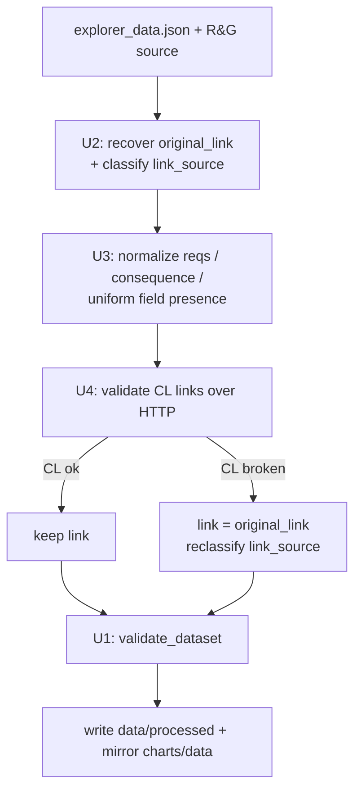

# refactor: Clean up explorer data schema, preserve Lexis links, prune broken CourtListener links

## Summary

Clean up `data/processed/explorer_data.json` (736 records) so it has a uniform,
well-typed schema and so original source links are never destroyed. The current
pipeline overwrites each record's single `link` field with a CourtListener (CL)
URL when it finds one, permanently discarding the original Lexis permalink. This
plan stops that data loss, **recovers** the Lexis links already lost (from the
R&G source file), validates CL links over HTTP and prunes the broken ones (falling
back to the Lexis link), and normalizes the messy parts of the schema (`reqs`,
`consequence`, uneven field presence).

The web explorer (`charts/`), Plotly charts, and the rest of the pipeline are
**not** changed except where required to keep them working. The query CLI and
Claude skill discussed earlier are **explicitly deferred** to a follow-up plan.

---

## Problem Frame

`scripts/update.py` builds each record with a single `link` field, then
`replace_lexis_links()` ([scripts/update.py:281](scripts/update.py:281)) **mutates
`entry['link']` in place** with the CL URL — the original Lexis permalink is gone.

Current link state across 736 records:

| `link` domain | Count | Note |
|---|---|---|
| law.justia.com / dockets.justia.com / others | 158 / 81 / … | free, fine |
| www.courtlistener.com | 127 | machine-generated search/docket URLs — some are broken |
| advance.lexis.com | 36 | paywalled, still original |
| www.westlaw.com / 1.next.westlaw.com | 12 / 12 | paywalled, never replaced |

The original Lexis URL is recoverable: `data/sources/ropes_gray_court_orders.json`
is a dict of 681 R&G items, each with `id` and `linkToCourtOrder.url` (the original
Lexis permalink); 535 mention Lexis. Records join on `_rg_id` (= source `id`) where
present (139/629 R&G records) and otherwise on the dedup key (date + state + judge).

Separately, the schema is uneven:
- **`reqs`** mixes representations: boolean flags stored as `'checked'` (687×) **and**
  `'Yes'` (139×), plus rule-citation strings like `'FRCP 11'` (193×) living in the
  same dict. The explorer only tests truthiness, so this is invisible in the UI but
  bad for any structured consumer.
- **`consequence`** is `''` (empty string) on 210 records instead of a consistent null.
- **Field presence is uneven**: `sanction_types` on 239/736 (absent — not empty — on
  the rest), `_rg_id` on only 139/629 R&G records.

## Goals

1. No original source link is ever destroyed; lost Lexis links are recovered.
2. Broken CL links are detected (live HTTP) and pruned, falling back to the Lexis link.
3. The record schema is uniform and well-typed, with a validator enforcing it.
4. The explorer keeps working unchanged (it reads `link` and truthy `reqs`/`consequence`).
5. The pipeline (`update.py`) produces the cleaned schema going forward — the cleanup is durable, not a one-shot.

## Non-Goals / Scope Boundaries

**In scope:** `data/processed/explorer_data.json` and its mirror at
`charts/data/explorer_data.json`; `scripts/update.py` durability changes; a new
one-time cleanup driver and supporting modules; schema validation + tests.

### Deferred to Follow-Up Work
- The query **CLI** and the **Claude skill** on top of the data (separate plan).
- Finding free CL alternatives for **Westlaw** paywalled links (this plan only
  preserves/recovers Lexis and prunes CL; Westlaw links are left as-is with
  `link_source: "westlaw"`).
- Cleaning `data/processed/bar_opinions.json` — it is already versioned and clean
  (`schema_version`, `last_modified`, `items`); out of scope unless requested.

### Not in scope
- Any change to the explorer UI, Plotly charts, or rendered `charts/dist/*` build
  artifacts (regenerated by `vite build`, not hand-edited).
- Inventing missing content (empty `judge`/`court`/`date`/`summary` stay empty; they
  are data gaps, not schema gaps).

---

## Decisions Confirmed With User

| Decision | Choice |
|---|---|
| When a CL link is broken/pruned, what does `link` become? | **Fall back to the original Lexis/source link** (revert `link` → `original_link`). |
| How is "broken CL link" detected? | **Live HTTP check** — one-time cleanup pass, rate-limited and cached. |
| Scope ordering | **Data cleanup first**; CLI + Claude skill deferred. |

---

## Key Technical Decisions

### KTD1 — Add link-provenance fields instead of changing `link` semantics
`link` keeps its current meaning (the best displayed/free link the explorer reads),
so the explorer is untouched. Provenance is captured in **new** fields:
- `original_link` (string): the original R&G/source URL (Lexis or other). Never
  overwritten. Recovered from the R&G source where already lost; `""` if none exists.
- `link_source` (enum string): what `link` currently points at — one of
  `courtlistener`, `lexis`, `westlaw`, `justia`, `govinfo`, `ropesgray`, `other`, `none`.

Rationale: additive fields are backward-compatible with the explorer and with the
mirrored copies; no UI logic changes.

### KTD2 — `reqs` normalization rule
For each key in a record's `reqs` dict: boolean-flag keys (`disclose`, `tool`, `how`,
`sections`, `verify`, `certify_all`, `certify_if_ai`, `prompts`, `proprietary`,
`prohibited`, `warning`, `evidence`) → coerce truthy values (`'checked'`, `'Yes'`,
etc.) to boolean `true`; the citation-bearing key (`rules`) keeps its string value
(e.g., `"FRCP 11"`). Absent key = not required (stays absent). Truthiness is preserved,
so the explorer's `if(r[k])` checks behave identically.

### KTD3 — `consequence` and field-presence normalization
`consequence: ""` → `null`. Every record gets a uniform key set: missing
`sanction_types` → `{"amount_awarded": null, "amount_sought": null, "types": []}`;
missing `reqs` → `{}`; `_rg_id` present (string) for all R&G/`both`-sourced records
via the source join, `null` for rails-only. All falsy-equivalent to the explorer's guards.

### KTD4 — A single schema validator is the source of truth
`scripts/schema.py` defines the canonical record contract and `validate_dataset()`.
Both the one-time cleanup driver and the pipeline call it before writing, and the
test suite asserts against it. This prevents the cleaned schema from silently drifting.

### KTD5 — CL validation is offline-testable
The live HTTP validator is isolated behind a small function so tests inject a fake
fetcher (no real network in CI). The one-time run is rate-limited, caches results to
disk, and is resumable so a network hiccup doesn't lose progress.

---

## High-Level Technical Design

One-time cleanup driver (`scripts/cleanup.py`) runs the stages in order; the pipeline
reuses the same modules so new entries land already-clean.



Field-level before/after for a record whose Lexis link was overwritten with a now-broken CL link:

```text
before: { link: "courtlistener.com/?q=…" }            # original Lexis lost
after:  { link: "advance.lexis.com/permalink/…",      # reverted (CL was broken)
          original_link: "advance.lexis.com/permalink/…",
          link_source: "lexis" }
```

*Directional guidance — not implementation specification.*

---

## Implementation Units

### U1. Canonical schema contract + validator
- **Goal:** One authoritative definition of the cleaned record schema, callable by the cleanup driver, the pipeline, and tests.
- **Requirements:** Goal 3, KTD4.
- **Dependencies:** none.
- **Files:** `scripts/schema.py` (new); `scripts/tests/test_schema.py` (new).
- **Approach:** Define the required key set and types (including `original_link: str`, `link_source: <enum>`). Provide `validate_record(rec) -> list[str]` (returns problems) and `validate_dataset(records) -> list[str]`. No mutation — validation only. Keep the `link_source` enum as a module constant reused by U2/U4.
- **Patterns to follow:** plain-stdlib style of `scripts/analysis.py` / `scripts/update.py` (no third-party deps).
- **Test scenarios:**
  - Happy path: a fully-formed cleaned record returns no problems.
  - Edge: record missing `original_link` / `link_source` is reported.
  - Edge: `link_source` outside the enum is reported.
  - Edge: `reqs` flag value that is a non-boolean (e.g., `'checked'`) is reported (so cleanup can't skip normalization).
  - Error: `consequence: ""` is reported as non-normalized (must be `null`).
- **Verification:** `validate_dataset()` returns an empty list only for fully-cleaned input; running it on today's raw `explorer_data.json` returns a non-empty list.

### U2. Original-link recovery + `link_source` classification
- **Goal:** Populate `original_link` (recovering lost Lexis URLs) and `link_source` for every record, without touching `link`.
- **Requirements:** Goals 1 & part of 2, KTD1.
- **Dependencies:** U1 (enum constant).
- **Files:** `scripts/linkrecover.py` (new); `scripts/tests/test_linkrecover.py` (new); reads `data/sources/ropes_gray_court_orders.json`.
- **Approach:** Build an index of R&G source items keyed by `id` and by normalized (date, state, judge). For each explorer record: set `original_link` from the matching source `linkToCourtOrder.url`; if `link` is already a Lexis/source URL and `original_link` is empty, copy `link` into `original_link`. Classify `link_source` from the `link` domain (CL/lexis/westlaw/justia/govinfo/ropesgray/other/none). Pure function over inputs — no network.
- **Patterns to follow:** the dedup key already used by the pipeline (date + state + judge); reuse its normalization so the join matches the existing dedup.
- **Test scenarios:**
  - Happy path: record with `_rg_id` joins to source and recovers the Lexis `original_link`.
  - Happy path: record without `_rg_id` joins by (date, state, judge).
  - Edge: record whose `link` is already Lexis and has no source match → `original_link` copied from `link`.
  - Edge: rails-only record with no source match → `original_link = ""`, `link_source` classified from its own `link`.
  - Edge: every `link` domain maps to the correct `link_source` enum value (table-driven).
- **Verification:** after the pass, count of records with non-empty `original_link` ≥ count of R&G/`both`-sourced records that have a source Lexis URL; `link` values are byte-identical to input.

### U3. Schema normalization pass
- **Goal:** Normalize `reqs`, `consequence`, and field presence to the canonical schema.
- **Requirements:** Goal 3, KTD2 & KTD3.
- **Dependencies:** U1.
- **Files:** `scripts/normalize.py` (new); `scripts/tests/test_normalize.py` (new).
- **Approach:** Pure transform over a record list. Apply KTD2 (`reqs` flags→bool, keep `rules` string), KTD3 (`consequence ""`→`null`, fill missing `sanction_types`/`reqs`, uniform `_rg_id`). Idempotent: running twice equals running once.
- **Patterns to follow:** `REQ_LABELS` / `REQ_ACTIONS` key list in `charts/src/constants.js` is the authoritative set of flag keys; mirror it.
- **Test scenarios:**
  - Happy path: `reqs.disclose: 'checked'` and `reqs.verify: 'Yes'` both become `true`; `reqs.rules: 'FRCP 11'` is unchanged.
  - Edge: record with empty `reqs: {}` is left as `{}`.
  - Edge: `consequence: ""` → `null`; `consequence: "warning"` unchanged.
  - Edge: record missing `sanction_types` gains the empty shape; record that already has it is untouched.
  - Idempotency: `normalize(normalize(x)) == normalize(x)`.
  - Integration: normalized output of a real sample passes `validate_dataset()` (U1) for the `reqs`/`consequence`/presence checks.
- **Verification:** no `reqs` value equals `'checked'`/`'Yes'` after the pass; no `consequence` is `""`; all records share an identical key set.

### U4. Broken CL-link validation + Lexis fallback (live HTTP)
- **Goal:** Detect broken CourtListener links over HTTP and revert them to `original_link`.
- **Requirements:** Goal 2, KTD5; confirmed decisions (Lexis fallback, live HTTP).
- **Dependencies:** U2 (needs `original_link` populated to fall back to).
- **Files:** `scripts/linkcheck.py` (new); `scripts/tests/test_linkcheck.py` (new); cache at `data/processed/cl_link_cache.json` (new, git-ignored or committed per repo convention).
- **Approach:** For each record with `link_source == "courtlistener"`, fetch the URL (HEAD then GET fallback) through an injectable fetcher; treat 404/error/empty-search-result pages as broken. On broken: set `link = original_link` (or `""` if none), reclassify `link_source`. Rate-limit, cache results by URL, resumable. The validation predicate (status/empty-result detection) is a pure function tested independently of the network.
- **Execution note:** isolate the fetcher behind a parameter so tests inject a fake; never hit the network in CI.
- **Test scenarios:**
  - Happy path: CL link returning 200 with a real docket/opinion stays unchanged.
  - Error: CL link returning 404 → `link` reverts to `original_link`, `link_source` → `lexis` (or `none` if no original).
  - Edge: CL "search with zero results" page is classified broken even at HTTP 200.
  - Edge: broken CL link with empty `original_link` → `link = ""`, `link_source = "none"`.
  - Edge: cached result short-circuits the fetcher (fetcher not called on second run).
  - Non-CL links are never fetched.
- **Verification:** after the pass, no `link_source == "courtlistener"` record points at a known-broken URL in the cache; reverted records carry their Lexis `original_link` in `link`.

### U5. One-time cleanup driver + re-mirror
- **Goal:** Orchestrate U2→U3→U4 over the real dataset, validate, and write canonical + mirror.
- **Requirements:** Goals 1–4.
- **Dependencies:** U1, U2, U3, U4.
- **Files:** `scripts/cleanup.py` (new); writes `data/processed/explorer_data.json` and `charts/data/explorer_data.json`; `scripts/tests/test_cleanup.py` (new).
- **Approach:** Load canonical `explorer_data.json`, run recover → normalize → CL-check, call `validate_dataset()` (U1) and **refuse to write** on validation errors, then write canonical and mirror to `charts/data/` (matching `update.py`'s `CHARTS_DATA_DIR` behavior). Flags: `--no-http` (skip U4 for a fast offline run), `--dry-run` (report counts, write nothing). Idempotent on re-run.
- **Patterns to follow:** `update.py` already mirrors to `CHARTS_DATA_DIR`; reuse the same write+mirror helper.
- **Test scenarios:**
  - Happy path (offline, `--no-http`): a fixture dataset is recovered + normalized and passes validation; both output paths written.
  - Error: a record that fails validation aborts the write (no partial file).
  - Idempotency: running `cleanup.py` twice yields an identical file.
  - Integration: mirror at `charts/data/explorer_data.json` is byte-identical to `data/processed/explorer_data.json` after the run.
- **Verification:** post-run `validate_dataset()` is empty; the dev explorer (`charts/`, reads `./data`) loads and renders the list without console errors.

### U6. Pipeline durability in `scripts/update.py`
- **Goal:** New entries are written in the cleaned schema and link recovery/pruning is preserved on every run — the cleanup is permanent, not one-off.
- **Requirements:** Goal 5.
- **Dependencies:** U1, U2, U3, U4.
- **Files:** `scripts/update.py` (modify: record builder around [scripts/update.py:376-438](scripts/update.py:376), `replace_lexis_links()` [scripts/update.py:242-287](scripts/update.py:242)); `scripts/tests/test_update_schema.py` (new).
- **Approach:** When building a record, set `original_link` from `linkToCourtOrder.url` and classify `link_source` (U2 helpers). Change `replace_lexis_links()` so that on a successful CL match it sets `link = cl_url` **while leaving `original_link` intact**, and when a CL link is found broken it does not adopt it. Run U3 normalization on appended entries and call `validate_dataset()` before writing canonical + mirror. Preserve the existing incremental/backfill flags.
- **Execution note:** add a characterization test capturing today's `replace_lexis_links` join behavior before modifying it, so the link-matching logic isn't regressed.
- **Test scenarios:**
  - Happy path: a freshly built record has `original_link` + valid `link_source` and passes `validate_dataset()`.
  - Behavior change: `replace_lexis_links` sets `link` to the CL URL but `original_link` still holds the Lexis URL (no destruction).
  - Edge: a new entry with no source link gets `original_link = ""`, `link_source = "none"`.
  - Regression: characterization test for the existing CL-match path still passes.
- **Verification:** a dry-run of `update.py` on a small fixture produces records that pass `validate_dataset()` and retain `original_link`.

---

## Risks & Dependencies

| Risk | Mitigation |
|---|---|
| Live HTTP check is slow / flaky for 127 CL links | Rate-limit + cache + resumable (U4); `--no-http` fast path (U5); offline tests. |
| Date+state+judge join mis-matches a record to the wrong source item | Prefer `_rg_id` exact join; only fall back to the dedup key; unit tests for both paths (U2). |
| Schema change breaks the explorer | Additive fields only; `reqs`/`consequence` normalization preserves truthiness; U5 verification loads the dev explorer. |
| Mirror copies drift (`charts/public/data`, `charts/dist/data`) | Treat `dist`/`public` as build artifacts regenerated by `vite build`; this plan writes only `data/processed` + `charts/data` (what `update.py` already targets). |
| Recovered "original" Lexis link is itself paywalled/dead | Acceptable per confirmed decision (fall back to Lexis); `link_source` records provenance so a future pass can revisit. |

## Open Questions (deferred to implementation)
- Should the CL-link cache (`data/processed/cl_link_cache.json`) be committed or git-ignored? Follow whatever convention `data/processed/cl_review.json` uses.
- Whether to add an optional `link_status` (`ok`/`broken`/`unchecked`) audit field — only if the CLI follow-up needs it; omitted here to avoid schema bloat.

## Verification Strategy
- `python3 -m pytest scripts/tests/` green.
- `python3 scripts/cleanup.py --dry-run` reports expected recovery/prune counts; full run leaves `validate_dataset()` empty.
- Dev explorer (`charts/`) loads the cleaned `charts/data/explorer_data.json` and renders list + detail with no console errors.
