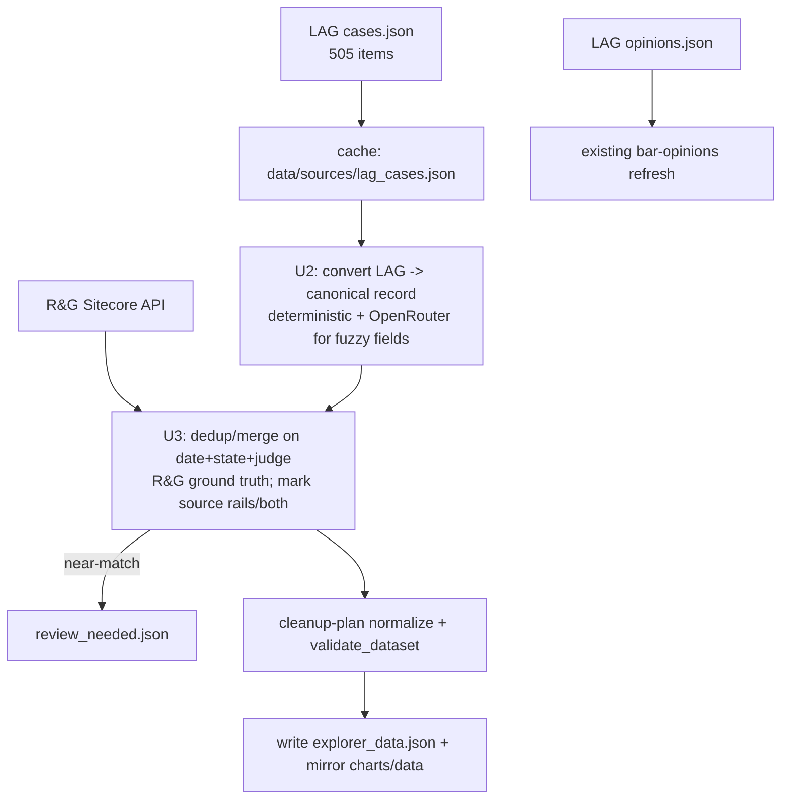

# feat: Automate LAG/RAILS court-order ingestion + live refresh from both sources

## Summary

Automate ingestion of the **legalaigovernance.com (LAG/RAILS) court-order
tracker** into the pipeline and run a live refresh from **both** sources (R&G +
LAG). Today `scripts/update.py` auto-pulls R&G court orders and LAG *bar
opinions*, but LAG's **court-order cases** were merged **once, by hand, in a
different repo** (`/Users/hao/ClaudeCode/rails-analysis/`) from a manually
exported `All_Data.csv`. There is no script that ingests them, so the "rails"
records (currently 107 of 736 in the explorer) go stale.

LAG publishes the court-order tracker as JSON at
`https://legalaigovernance.com/data/cases.json` — **505 versioned case records**
(schema: `schema_version` / `last_modified` / `count` / `items`), structured just
like the already-automated `opinions.json`. This plan adds a fetch → convert →
dedup/merge step to the pipeline that targets that endpoint (no manual CSV), then
runs a live refresh from both sources.

**Depends on** the schema-cleanup plan
(`docs/plans/2026-06-15-001-refactor-data-schema-cleanup-plan.md`): converted LAG
records must conform to that plan's canonical schema (`scripts/schema.py`,
`original_link` / `link_source`, normalization). **Sequence: cleanup plan first,
this plan second.**

---

## Problem Frame

`scripts/update.py` `main()` ([scripts/update.py:509](scripts/update.py:509)):
- Step 2 fetches R&G via Sitecore API ([scripts/update.py:546](scripts/update.py:546)) — automated, incremental.
- Step 7 refreshes LAG **bar opinions** from `LAG_BASE/opinions.json` ([scripts/update.py:644](scripts/update.py:644)) — automated.
- **No step** fetches LAG **court-order cases.** Those came from `data/sources/All_Data.csv` → ad-hoc cleaning/merge in `rails-analysis` (`merge_report.txt` output path confirms the foreign repo) → `orders_merged.csv` → `explorer_data.json`. The merge scripts are not in this repo.

The current dataset reflects a **May 2026 snapshot**: 77 RAILS-only + 31 matched
in `merge_report.txt`. LAG now serves **505** cases — a fresh automated pull
materially expands and updates the dataset.

### LAG `cases.json` record shape (live, 505 items)

| Field | Example / values |
|---|---|
| `slug`, `url` | `krista-geddes-v-loancare`, `…/tracker/cases/krista-geddes-v-loancare/` |
| `case_name`, `citation` | `Geddes v. LoanCare, LLC`, `No. 2:25-cv-02955 (E.D. Cal. Apr. 22, 2026) (Cota, Mag. J.)` |
| `court`, `jurisdiction`, `date` | `U.S. District Court, E.D. Cal.`, `E.D. Cal.`, `2026-04-22` |
| `ai_tool` | free-text (`Unspecified generative AI`, `Westlaw CoCounsel`, …) |
| `sanction_type` | enum: `court_sanction` (328), `other` (140), `warning` (22), `bar_discipline` (15) |
| `sanction_amount`, `pending`, `outcome`, `description` | `$1,000`, `False`, prose, prose |
| `source_urls`, `primary_source_urls` | all 505 have ≥1 `source_urls` |

## Goals

1. Pull LAG court-order cases from `cases.json` automatically — no manual CSV.
2. Convert each LAG case into the canonical explorer record schema (cleanup plan).
3. Dedup/merge against R&G with R&G as ground truth; mark `source` `rails`/`both`.
4. Wire it into `update.py` so every run refreshes LAG cases incrementally.
5. Run a live refresh from both sources and verify the explorer still loads.

## Non-Goals / Scope Boundaries

**In scope:** `scripts/update.py` (new LAG-cases step), new conversion + merge
modules, raw cache at `data/sources/lag_cases.json`, tests, one live refresh run.

### Deferred to Follow-Up Work
- Query CLI + Claude skill (separate, later plan).
- Westlaw free-link recovery (cleanup plan's boundary still applies).

### Not in scope
- Re-importing from `All_Data.csv` / `rails-analysis` — superseded by the live `cases.json` pull. The CSVs remain as historical artifacts only.
- Explorer UI / Plotly chart changes.

---

## Decisions Confirmed With User

| Decision | Choice |
|---|---|
| LAG court-order data | **Automate it in the pipeline** (replace the manual CSV merge). |
| Run vs wire | **Run a live refresh too** after building (needs `OPENROUTER_API_KEY`, optional `CL_API_KEY`). |
| Plan shape | **Separate plan** from the schema cleanup. |

---

## Key Technical Decisions

### KTD1 — Pull `cases.json`, not the CSV
Fetch `https://legalaigovernance.com/data/cases.json` via the existing
`fetch_json()` ([scripts/update.py:291](scripts/update.py:291)); cache raw to
`data/sources/lag_cases.json` (mirroring how R&G raw lands in
`data/sources/ropes_gray_court_orders.json`). The CSV path is retired.

### KTD2 — Deterministic mapping first, AI conversion only for fuzzy fields
LAG fields map deterministically where possible: `description`→`summary`,
`date`→`date`, `case_name`→`name`, `source_urls[0]`→`link`/`original_link`,
`sanction_amount`→`sanction_types.amount_awarded`, `pending`→a pending marker.
Fields that need inference — `judge` (parse from `citation`, e.g. `(Cota, Mag.
J.)`), `state`/`state_abbr` (from `court`/`jurisdiction`), `applies_to`,
`ai_type` (normalize `ai_tool`→`Gen AI`/`Any AI`), and attorney-vs-party
`consequence` — go through the **existing OpenRouter conversion** that R&G
entries already use (`EXPLORER_SCHEMA_PROMPT`), with a deterministic/regex
fallback. This reuses proven infra rather than adding a new LLM path.

### KTD3 — `consequence` / `sanction_types` mapping from `sanction_type`
`warning`→`consequence:"warning"`; `court_sanction`/`bar_discipline`→a sanction
consequence (attorney vs party resolved by conversion, `bar_discipline` adds
`bar_referral` to `sanction_types.types`); `other`→derive from `outcome` text or
`null`. `sanction_amount` parsed into `amount_awarded`.

### KTD4 — R&G is ground truth on merge
Dedup on the existing key (date + state + judge, same normalization the pipeline
already uses). On a match: `source` becomes `both`, R&G field values win,
LAG fills only gaps. LAG-only → `source:"rails"`. Near-matches (fuzzy key
collisions) are written to `data/processed/review_needed.json` rather than
silently merged — `merge_report.txt` flagged 6 such cases last time.

### KTD5 — Output conforms to the cleanup plan's schema + validator
Converted/merged records run through the cleanup plan's normalization and
`validate_dataset()` ([cleanup plan U1/U3]) before write. `original_link` /
`link_source` are populated from `source_urls`. This plan does not redefine the
schema — it produces records that satisfy it.

---

## High-Level Technical Design

*Directional guidance — not implementation specification.*

---

## Implementation Units

### U1. Fetch + cache LAG cases
- **Goal:** Pull `cases.json` and persist raw, with version awareness.
- **Requirements:** Goal 1, KTD1.
- **Dependencies:** none (uses existing `fetch_json`).
- **Files:** `scripts/lag_cases.py` (new: fetch + cache); `scripts/tests/test_lag_cases.py` (new); cache `data/sources/lag_cases.json`.
- **Approach:** Add `LAG_CASES_URL = f'{LAG_BASE}/cases.json'`. Fetch, assert the `schema_version`/`items` envelope, write raw cache. Expose `load_cached()` for offline tests/runs. Compare `last_modified` to skip no-op refetches.
- **Patterns to follow:** the bar-opinions fetch at [scripts/update.py:644](scripts/update.py:644); raw-cache pattern of `ropes_gray_court_orders.json`.
- **Test scenarios:**
  - Happy path: fixture envelope parses; `items` count returned.
  - Edge: missing/!=expected `schema_version` raises a clear error.
  - Edge: unchanged `last_modified` short-circuits (no rewrite).
  - Fetcher is injectable (no network in CI).
- **Verification:** running the fetch writes `data/sources/lag_cases.json` with 505+ items.

### U2. Convert LAG case → canonical explorer record
- **Goal:** Map each LAG case to the cleanup-plan schema, using OpenRouter only for fuzzy fields.
- **Requirements:** Goals 2 & 3 (record shape), KTD2 & KTD3 & KTD5.
- **Dependencies:** U1; cleanup plan U1 (`schema.py`), U2 (`link_source` classifier), U3 (normalize).
- **Files:** `scripts/lag_convert.py` (new); `scripts/tests/test_lag_convert.py` (new).
- **Approach:** Deterministic mapping (table in KTD2/KTD3). For `judge`/`state`/`applies_to`/`ai_type`/attorney-vs-party, call the existing OpenRouter conversion (reuse `EXPLORER_SCHEMA_PROMPT` infra) with regex fallback for judge parsing from `citation`. Set `link`/`original_link` from `source_urls[0]`, classify `link_source`. Output passes `validate_dataset()`.
- **Patterns to follow:** R&G conversion / `EXPLORER_SCHEMA_PROMPT` path in `update.py` (record builder ~[scripts/update.py:376](scripts/update.py:376)).
- **Test scenarios:**
  - Happy path: a `court_sanction` case → `consequence` a sanction, `sanction_types.amount_awarded` parsed from `$1,000`.
  - Mapping: `sanction_type:"warning"`→`consequence:"warning"`; `bar_discipline`→`bar_referral` in `types`; `other`→derived/`null`.
  - Edge: judge parsed from `citation` `(Cota, Mag. J.)`; fallback to `""` when absent.
  - Edge: `ai_tool` free-text normalized to `Gen AI` vs `Any AI`.
  - Edge: empty `source_urls` → `link=""`, `link_source="none"`.
  - Integration: converted record passes `validate_dataset()` (cleanup U1).
  - AI path is mocked (no live LLM in CI).
- **Verification:** all 505 cached cases convert to records that pass `validate_dataset()`.

### U3. Dedup / merge against R&G (R&G ground truth)
- **Goal:** Merge converted LAG records into the dataset without duplicating R&G.
- **Requirements:** Goal 3, KTD4.
- **Files:** `scripts/lag_merge.py` (new); `scripts/tests/test_lag_merge.py` (new); writes `data/processed/review_needed.json`.
- **Approach:** Build the date+state+judge index over existing records (reuse the pipeline's dedup-key normalization). LAG match → `source:"both"`, R&G fields win, LAG fills gaps; LAG-only → `source:"rails"`. Fuzzy/near key collisions → `review_needed.json`, not merged. Reproduces `merge_report.txt` semantics (RAILS-only / R&G-only / matched / flagged counts).
- **Patterns to follow:** README "deduplicates on date + state + judge"; existing dedup in `update.py`.
- **Test scenarios:**
  - Happy path: exact key match marks `source:"both"`, keeps R&G values, fills a gap from LAG.
  - Happy path: LAG-only case added with `source:"rails"`.
  - Edge: near-match (same date+state, judge differs by title) → flagged to `review_needed.json`, not merged.
  - Edge: re-running merge is idempotent (no duplicate insertions).
  - Output: a merge summary mirrors `merge_report.txt` (counts by source).
- **Verification:** merged dataset has no duplicate date+state+judge keys; summary counts reconcile (R&G-only + RAILS-only + both = total).

### U4. Wire LAG-cases ingestion into `update.py`
- **Goal:** Make the LAG-cases pull part of every pipeline run, incrementally.
- **Requirements:** Goal 4.
- **Files:** `scripts/update.py` (modify `main()` — add a step after R&G fetch / before validate+write); `scripts/tests/test_update_lag_step.py` (new).
- **Approach:** Add Step "2b. Fetch + convert + merge LAG cases" using U1–U3. Incremental via `last_modified`/date cutoff like R&G. Run cleanup-plan normalization + `validate_dataset()` before writing canonical + mirror. Keep existing flags (`--backfill`, incremental). Surface the merge summary in stdout.
- **Execution note:** add a characterization test of `main()`'s existing R&G-only path before inserting the LAG step, so the R&G flow is provably unchanged.
- **Test scenarios:**
  - Happy path (mocked fetchers + LLM): a run ingests LAG cases, merges, validates, writes both paths.
  - Edge: LAG fetch failure warns and continues with R&G (no abort, no partial write).
  - Regression: R&G-only characterization test still passes.
  - Validation failure aborts the write.
- **Verification:** dry-run on fixtures produces a validated, merged dataset; R&G path unaffected.

### U5. Live refresh from both sources + verification
- **Goal:** Execute a real end-to-end refresh and confirm correctness.
- **Requirements:** Goal 5; confirmed "run a refresh too".
- **Dependencies:** U1–U4; cleanup plan complete.
- **Files:** run `scripts/update.py` (or `scripts/weekly_update.sh`); no new source files. Updates `data/processed/explorer_data.json` + `charts/data/` + `data/sources/lag_cases.json` + `bar_opinions.json`.
- **Approach:** With `OPENROUTER_API_KEY` (and optional `CL_API_KEY`) set, run the full pipeline: R&G fetch + LAG cases ingest + bar-opinions refresh + cleanup-plan link recovery/prune + validate + mirror. Review `review_needed.json` for flagged near-matches. Record before/after counts.
- **Execution note:** this unit performs an external/live action (network + LLM spend); confirm keys and intent before running.
- **Test scenarios:** `Test expectation: none — live operational run, covered by U1–U4 unit tests.`
- **Verification:** post-run `validate_dataset()` empty; dataset count increases toward ~505 LAG-derived + R&G; dev explorer (`charts/`) loads cleaned `charts/data/explorer_data.json` with no console errors; `review_needed.json` reviewed.

---

## Risks & Dependencies

| Risk | Mitigation |
|---|---|
| LAG `cases.json` schema drifts | U1 asserts the `schema_version`/envelope and fails loudly. |
| OpenRouter conversion is slow / costs tokens for 505 cases | Deterministic-first mapping (KTD2) minimizes LLM calls; incremental cutoff avoids re-converting unchanged cases; cache converted records. |
| Bad judge/state inference creates false dedup matches | Near-matches go to `review_needed.json` (KTD4), never silent-merge; characterization + idempotency tests. |
| Depends on cleanup plan not yet merged | Hard sequencing: cleanup plan first; this plan imports `scripts/schema.py` + normalization. State checked in U2/CI. |
| Live run mutates committed data | Run on a branch; review diff + `review_needed.json` before committing. |

## Open Questions (deferred to implementation)
- Exact `sanction_type:"other"` → `consequence` rule (derive from `outcome` text vs leave `null`) — settle while writing U2 against real samples.
- Whether to keep `data/sources/lag_cases.json` committed or git-ignored — match the convention used for `ropes_gray_court_orders.json`.
- Whether `pending:true` cases should carry a distinct marker in the schema (cleanup plan deferred a `link_status`-style audit field; a `pending` flag is analogous).

## Verification Strategy
- `python3 -m pytest scripts/tests/` green (U1–U4).
- Dry-run `update.py` on fixtures: merged dataset validates; R&G path unchanged.
- Live `update.py` run (U5): validated dataset, explorer loads, near-matches reviewed.
